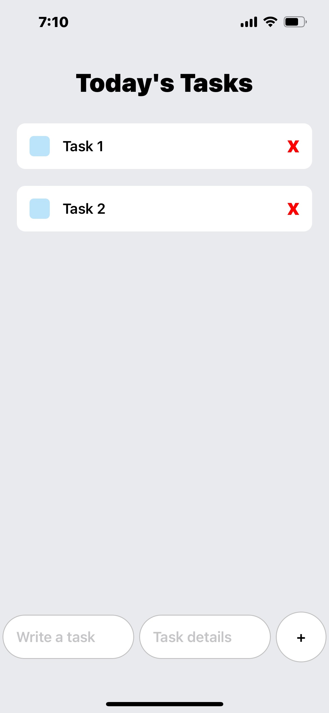
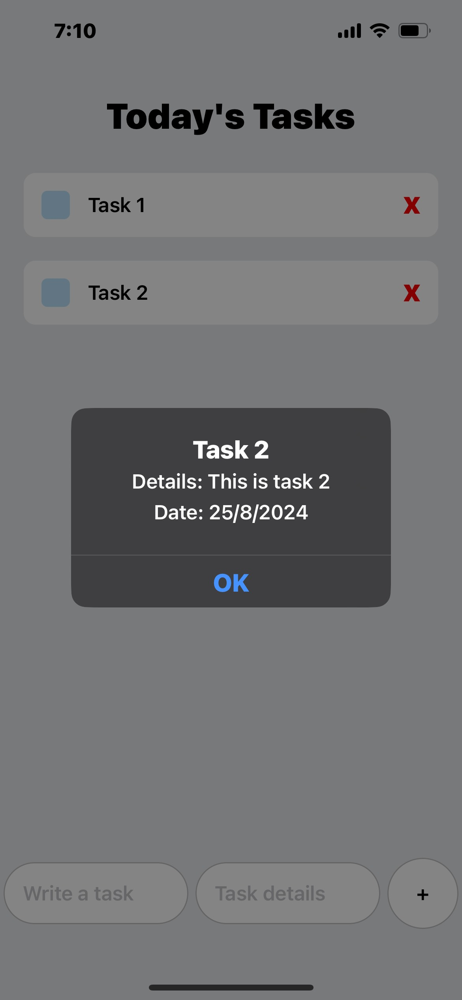

# React Native Task Management App

This is my first React Native project, a simple task management application that allows users to add, view, and delete tasks. The app is built using React Native with Expo, and it demonstrates basic state management, component structuring, and user input handling.

## Features

- **Add Tasks**: Users can input a task name and optional task details. The task is then added to the task list with the current date.
- **View Tasks**: The tasks are displayed in a scrollable list under the "Today's Tasks" section.
- **Delete Tasks**: Users can delete tasks by clicking on them, removing them from the list.

## Code Overview

- **State Management**: The app uses the `useState` hook to manage the input fields (`task` and `taskDetails`) and the list of tasks (`taskItems`).
- **Components**: The main component is `App`, which handles the core logic. The `Task` component (imported from `./components/Task`) is responsible for rendering each task.
- **UI Layout**: The app uses `View`, `Text`, `TextInput`, `TouchableOpacity`, and `ScrollView` to create the user interface, with styles defined using `StyleSheet`.

## How It Works

1. **Adding a Task**: 
   - The user enters a task and its details in the input fields.
   - Upon pressing the "+" button, the task is added to the task list with the current date, and the input fields are cleared.

2. **Viewing Tasks**:
   - All added tasks are displayed in the "Today's Tasks" section.
   - Each task shows the task name, details, and the date it was added.

3. **Deleting a Task**:
   - Tapping on a task removes it from the list.

## How to Run the App

1. Clone the repository.
2. Install dependencies using `npm install` or `yarn install`.
3. Run the app on a device or emulator using `expo start`.

## Future Improvements

- Adding a feature to edit tasks.
- Implementing task categories or priorities.
- Adding local storage or database integration to persist tasks.

